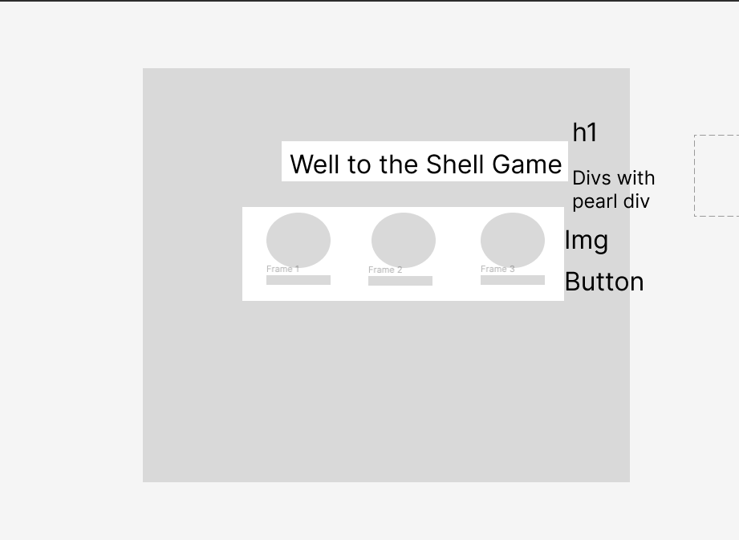

-h1
-div

-section
-divs x3 (each shells)

[]Open PR from dev to main with your changes 0.5

[x]Preview deploy from Netlify showing on your PR 0.5

[x]Clear commit history 1

[x]Good naming conventions and code is easy to read 1

[x]Effective use of CSS and semantic HTML 2

[x]Code Requirements
On clicking a hiding place button, the total number of guesses increment 2

[x]On clicking the correct shell button, the total number of correct guesses increment 2

[x]On clicking the incorrect shell button, the number of incorrect guesses increments 2

[]On click, see the ball revealed, clearing out the previous correct guess style 3

[x]displayResults function for displaying the updated state 3

[x]reset function for resetting the styles that display the correct location 3
